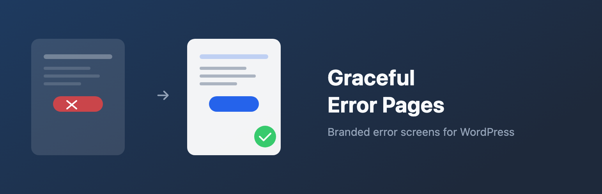
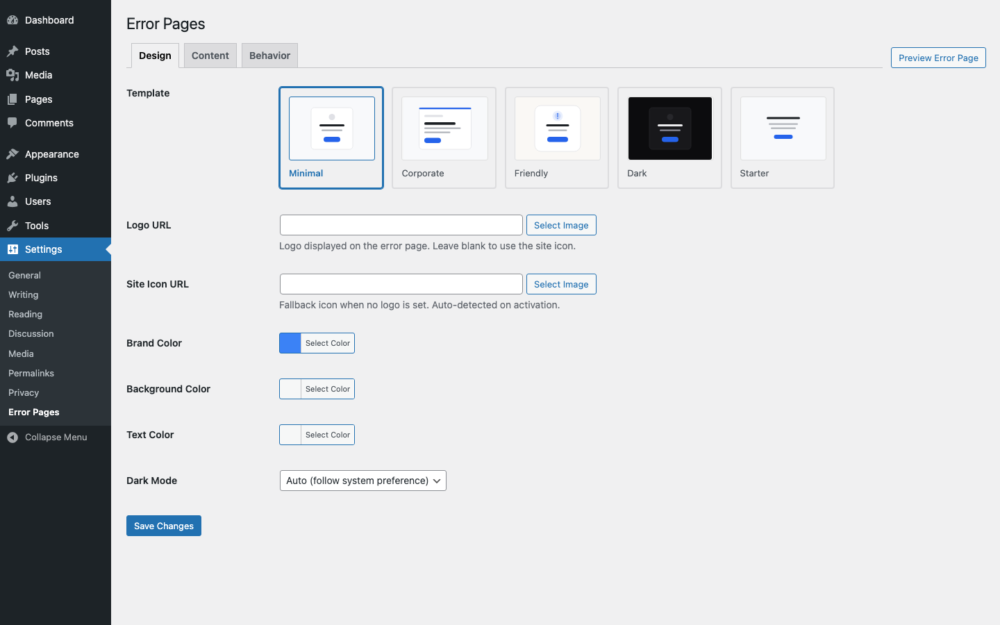
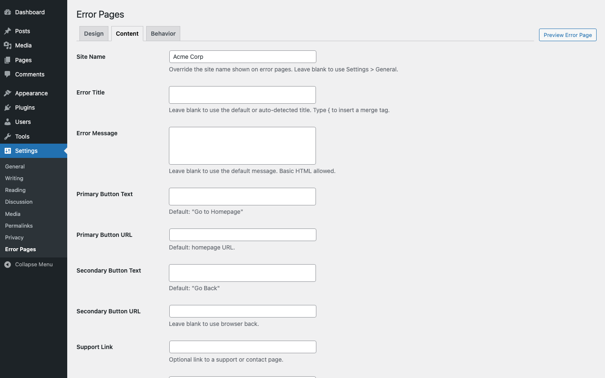
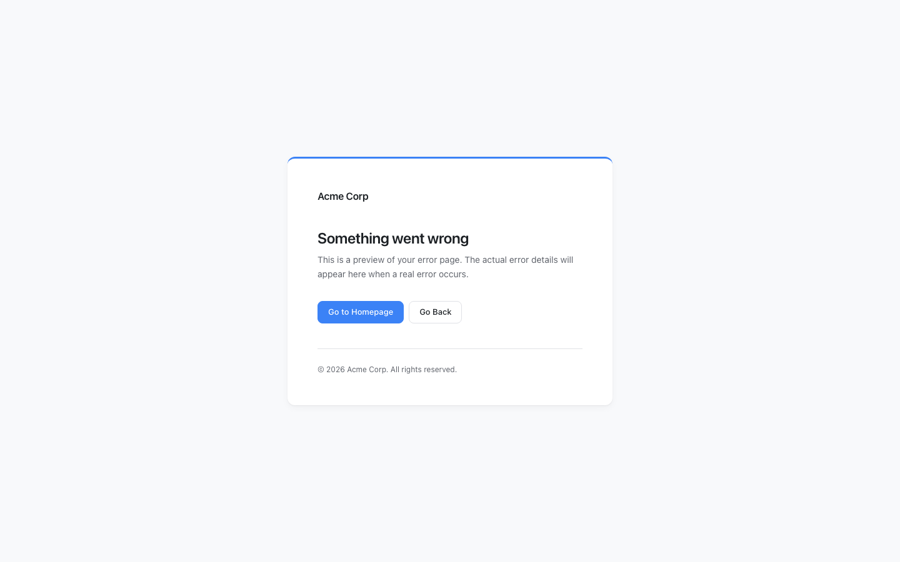

<p align="center">
  
</p>

# Graceful Error Pages

[](https://github.com/codeverbojan/graceful-error-pages/actions/workflows/ci.yml)
[](https://www.php.net/)
[](https://wordpress.org/)
[](https://www.gnu.org/licenses/gpl-2.0.html)

Replace WordPress's ugly error screens with branded, professional pages -- in one click.

Works immediately on activation. Auto-detects your site name, logo, and brand color. No configuration required.

---

## At a Glance

- **Purpose:** Replace the default `wp_die()` and PHP fatal error screens with branded pages
- **Best for:** Any WordPress site that cares about user experience during errors
- **Setup:** Zero-config -- activate and it works
- **Performance:** Zero overhead on normal page loads; only runs when an error occurs
- **API safe:** REST API, AJAX, JSON, and JSONP responses are never touched

---

## What It Replaces

1. **The `wp_die()` error screen** -- permission errors, expired nonces, security blocks, "Are you sure?" prompts, and any call to `wp_die()` with HTML output.
2. **The PHP fatal error screen** -- the white screen of death from uncaught exceptions, parse errors, and out-of-memory errors.

The default WordPress error screen is a plain white page with black text. It looks broken. Visitors don't know if the site is down, hacked, or just having a bad day. Graceful Error Pages replaces it with a page that matches your brand -- instantly.

---

## How It Works

1. Activate the plugin.
2. Error pages are branded immediately using auto-detected settings (site name, logo, colors).
3. Optionally customize via **Settings > Error Pages** -- pick a template, adjust colors, edit messaging, add merge tags.

---

## Key Features

### Zero-Config Activation
On activation, the plugin reads your site name from `bloginfo`, your logo from the Customizer, and your brand color from the theme's primary color setting. Everything is auto-configured. You can override any of these in the settings.

### Five Built-in Templates
Each template is fully self-contained with inline CSS -- no theme dependencies, no external CDN, no build step. They work even when your theme is completely broken.

- **Minimal** -- clean, light, centered layout (default)
- **Corporate** -- logo-forward, structured with clear hierarchy
- **Friendly** -- warm, encouraging tone with illustration
- **Dark** -- dark background, modern aesthetic
- **Starter** -- bare minimum styled text

### Merge Tags
Dynamic content in any text field. Type `{` to get an autocomplete dropdown with available tags:

- `{site_name}` -- your site name
- `{year}` -- current year
- `{home_url}` -- your site homepage URL
- `{back_url}` -- the URL to go back to

Merge tags work in error title, error message, button text, and copyright fields.

### Live Preview
Click "Preview Error Page" in the settings to see your changes in a modal iframe -- before saving. The preview reflects unsaved form state so you can iterate quickly.

### Brand Customization
- Logo and site icon upload
- Brand color, background color, text color
- Error title and message (with merge tags and basic HTML)
- Primary and secondary button text and URL
- Copyright text
- Support link

### Self-Contained Styling
Error page CSS is fully bundled with the plugin. No theme stylesheet, no CDN, no `wp_head()` / `wp_footer()`. This is critical because when `wp_die()` fires, the theme may not be loaded. During fatals, WordPress's hook system isn't available at all.

### API and CLI Safe
The plugin only overrides the HTML die handler. The AJAX, JSON, and JSONP die handlers are left untouched. WP-CLI is detected and skipped automatically. Your REST API, admin-ajax, and CLI workflows are never affected.

### Scope Control
By default, error pages only fire on the frontend. In settings, you can extend to admin-only or everywhere. Certain wp-admin contexts (Gutenberg saves, Customizer preview, Site Health) are always excluded to avoid interfering with WordPress internals.

### Dark Mode
Templates support `auto`, `on`, or `off` dark mode. In `auto` mode, the error page respects the visitor's `prefers-color-scheme` preference.

### Accessible
Settings UI follows WCAG 2.1: proper ARIA attributes on the merge tag autocomplete (combobox pattern with listbox, `aria-activedescendant`, `aria-selected`), focus trap on the preview modal, keyboard navigation, and focus restoration.

---

## Screenshots

<p align="center">
  <br />
  <strong>Minimal Template</strong> -- the default, replacing the WordPress error screen with a clean, centered layout
</p>

<p align="center">
  <br />
  <strong>Settings -- Design Tab</strong> -- template picker, logo, colors, and dark mode
</p>

<p align="center">
  <br />
  <strong>Settings -- Content Tab</strong> -- error title, message, buttons, and merge tags
</p>

<p align="center">
  <br />
  <strong>Corporate Template</strong> -- logo-forward, structured layout with clear hierarchy
</p>

<p align="center">
  <br />
  <strong>Dark Template</strong> -- dark background with modern aesthetic
</p>

---

## Installation

**From WordPress.org:**
Search for "Graceful Error Pages" in **Plugins > Add New**, install, and activate.

**From source:**

```bash
git clone https://github.com/codeverbojan/graceful-error-pages.git
cd graceful-error-pages
composer install
npm install
```

Then place the plugin folder in `wp-content/plugins/` and activate "Graceful Error Pages" from the WordPress admin.

### Requirements
- WordPress 6.4+
- PHP 8.0+

---

## Frequently Asked Questions

**Does this work out of the box?**
Yes. Activate it and error pages are branded immediately. No settings required.

**Will this break my REST API or AJAX?**
No. Only the HTML die handler is overridden. REST API, AJAX, JSON, and JSONP handlers are untouched.

**Does this affect wp-admin?**
Not by default. The handler only fires on the frontend unless you enable admin override in settings.

**Does this work with WP-CLI?**
Yes. CLI contexts are detected and skipped automatically.

**Does the plugin load anything on every page?**
No. The handler is registered on init but only renders when `wp_die()` is called or a fatal error occurs. Zero performance impact on normal page loads.

**Does this work with WooCommerce / page builders / caching plugins?**
Yes. Error pages are styled independently of your theme or any other plugin. No conflicts.

---

## Developer Setup

### Requirements
- PHP 8.0+, Composer 2.x, Node.js 18+, Docker

### Setup
```bash
git clone https://github.com/codeverbojan/graceful-error-pages.git
cd graceful-error-pages
composer install
npm install
```

### Local Environment
```bash
npm run env:start            # WordPress at http://localhost:8888 (admin / password)
npm run env:stop             # Stop
npm run env:clean            # Reset database
```

---

## Testing

The plugin has 122 unit tests with 332 assertions.

```bash
# Unit tests (no WordPress needed, fast)
composer test

# Single test
vendor/bin/phpunit --filter TestClassName::testMethodName

# Linting and static analysis
composer lint                # PHPCS (WordPress Coding Standards)
composer lint:fix            # PHPCBF auto-fix
composer analyze             # PHPStan level 6

# Run everything
composer check               # PHP lint + PHPStan + unit tests

# WordPress Plugin Check (needs wp-env running)
npm run plugin-check
```

### Code Quality
- PHPCS (WordPress Coding Standards 3.x) + PHPStan level 6
- `declare(strict_types=1)` in every PHP file
- PSR-4 autoloading: `GracefulErrorPages\` -> `src/`
- Pre-commit: PHPCS on staged files (Husky + lint-staged)
- Pre-push: Full PHPCS + PHPStan + unit tests

See [CONTRIBUTING.md](CONTRIBUTING.md) for the pull request process.

---

## Project Structure

```
src/                         7 PHP files
  AutoDetect.php             Logo/color/name detection from Customizer
  Handler.php                wp_die handler + fatal error shutdown handler
  Plugin.php                 Bootstrap: boot(), hooks, activate, deactivate
  Preview.php                AJAX preview endpoint for live preview modal
  Sanitizer.php              Input sanitization helpers
  Settings.php               Admin settings page (WordPress Settings API)
  TemplateEngine.php         Template loading + merge tag rendering
templates/                   5 error page templates
  minimal.php                Clean, light, centered (default)
  corporate.php              Logo-forward, structured
  friendly.php               Warm, encouraging
  dark.php                   Dark background, modern
  starter.php                Bare minimum styled text
assets/
  css/error-page.css         Error page styles (self-contained, no CDN)
  css/admin.css              Settings page styles
  js/admin.js                Preview modal, color picker, media uploader
  js/merge-tags.js           Merge tag input with pills and autocomplete
  images/                    Template thumbnails + default error icon (SVG)
tests/
  Unit/                      122 PHPUnit tests (Brain\Monkey, no WordPress)
  bootstrap.php              Test bootstrap with WP function stubs
```

---

## CI/CD

### GitHub Actions

**`ci.yml`** -- runs on every push and PR:
- Lint: PHP syntax check, PHPCS, PHPStan
- Unit tests: PHP 8.1, 8.2, 8.3, 8.4 matrix
- Build: verify distribution zip

**`release.yml`** -- triggered by `v*` tags:
1. Full CI including WordPress Plugin Check
2. Validates changelog in `readme.txt`
3. Generates `.pot` translation file
4. Builds distribution zip
5. Creates GitHub Release with zip artifact
6. Deploys to wordpress.org SVN

### Releasing

```bash
bash bin/release.sh 1.0.0    # Bump version, changelog, commit, tag, push
```

The release script validates the working tree, bumps version across all sync points (plugin header, constant, readme.txt, composer.json, phpstan-constants.php, bootstrap.php), generates the changelog from conventional commits, and pushes the tag. CI handles the rest.

---

## Roadmap

### v1.0.0 (current)
Custom `wp_die()` handler, PHP fatal error handler, five templates, admin settings with live preview, merge tag system with autocomplete, auto-detection of site branding, dark mode support, full i18n, comprehensive test suite.

### v2.0 (planned -- premium)
Redirect rules, error analytics, custom template editor, multisite network settings, WooCommerce-specific templates, white-label, import/export, error classification.

---

## License

GPL-2.0-or-later. See [LICENSE](LICENSE).
